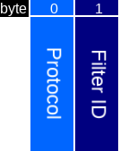
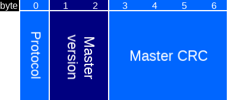
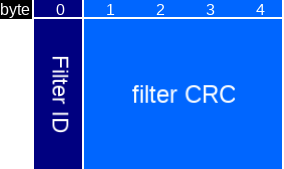
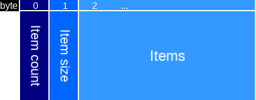
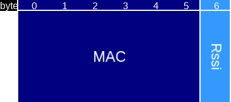
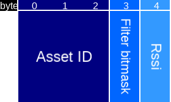
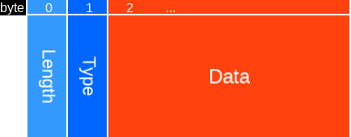

# Asset filter store

This page describes the commands and packets for the asset filter store.

Typical workflow for changing the filters:
1. [Get summaries](#get-filter-summaries) to find out what [protocol](#asset-filter-store-protocol-version) the firmware uses and which filters are currently in store.
2. [Upload](#upload-filter) new filters and [remove](#remove-filter) outdated ones.
3. [Commit](#commit-filter-changes) to complete the changes.

## Table of contents

Version
- [Protocol version](#asset-filter-store-protocol-version)

Commands packets
- [Get filter summaries](#get-filter-summaries)
- [Upload filter](#upload-filter)
- [Remove filter](#remove-filter)
- [Commit filter changes](#commit-filter-changes)

Filter description packets
- [Master version](#master-version)
- [Master CRC](#master-crc)
- [Filter summary](#filter-summary)
- [Asset ID](#asset-id)

Filter packets
- [Filter packet](#filter-packet)
- [Filter metadata](#filter-metadata)
- [Filter type](#filter-type)
- [Filter flags](#filter-flags)

Filter data packets
- [Exact match](#exact-match-filter-data)

Filter input and output packets
- [Input description](#filter-input-description)
- [Output description](#filter-output-description)
- [Output format](#filter-output-format)

Output packets
- [MAC](#mac-address-report)
- [Asset ID](#asset-id-report)

Advertisement data selection
- [BLE advertisement](#ble-advertisement)
- [Advertisement subdata](#advertisement-subdata)
- [Advertisement subdata type](#advertisement-subdata-type)
- [Masked AD data](#masked-ad-data)

*************************************************************************

## Protocol version

### Asset filter store protocol version

All asset filter store commands are prefixed with a protocol version.
This version will be incremented when making breaking changes to the protocol.

Value | Description
----- | -----------
0     | Current version.

*************************************************************************

## Commands

### Get filter summaries

Get a summary of all filters currently on the Crownstone and some extra metadata.

#### Get filter summaries result packet

Type | Name | Length | Description
---- | ---- | ------ | -----------
[Protocol version](#asset-filter-store-protocol-version) | Protocol | 1 | Protocol version of the Crownstone, commands should use the same protocol.
uint16 | [Master version](#master-version) | 2 | Current master version on the Crownstone.
uint32 | [Master CRC](#master-crc) | 4 | Current master CRC on the Crownstone.
uint16 | Free space | 2 | The number of free bytes for filter data. Note that each filter will have overhead.
[Filter summary](#filter-summary)[] | Summaries | N * 4 | Summaries of all filters currently on the Crownstone.

Result codes:
- `SUCCESS`: Success.
- `BUSY`: There are uncommitted filter changes. Commit or wait for timeout.

*************************************************************************

### Upload filter

Command to upload a filter in chunks. All chunks will be merged by the Crownstone. If a previously committed filter with the same filter ID is already present on the Crownstone, it will be removed prior to handling the chunk.

#### Upload filter packet

Type | Name | Length | Description
---- | ---- | ------ | -----------
[Protocol version](#asset-filter-store-protocol-version) | Protocol | 1 | Protocol of this packet.
uint8 | Filter ID | 1 | Which filter index to upload to.
uint16 | Chunk start index | 2 | Offset in bytes of this chunk.
uint16 | Total size | 2 | Total size of the filter data.
uint16 | Chunk size | 2 | Size of this chunk.
uint8[] | Chunk data | Chunk size | Chunk of a [filter packet](#filter-packet), starting at byte `Chunk start index` and `Chunk size` bytes in total.

Result codes:
- `SUCCESS`: Chunk has been stored.
- `INVALID_MESSAGE`: Chunk would overflow total size of the filter.
- `WRONG_STATE`: Total size changed between upload commands. All uploade chunks for this filter ID have been removed.
- `NO_SPACE`: There is not enough space for the given total filter size.

*************************************************************************

### Remove filter

Removes the filter with given filter ID.

#### Remove filter packet

Type | Name | Length | Description
---- | ---- | ------ | -----------
[Protocol version](#asset-filter-store-protocol-version) | Protocol | 1 | Protocol of this packet.
uint8 | Filter ID | 1 | ID of the filter to remove.

Result codes:
- `SUCCESS`: Filter has been removed.
- `SUCCESS_NO_CHANGE`: Filter was already removed.

*************************************************************************

### Commit filter changes

Commit the changes that were made.

#### Commit filter packet

Type | Name | Length | Description
---- | ---- | ------ | -----------
[Protocol version](#asset-filter-store-protocol-version) | Protocol | 1 | Protocol of this packet.
uint16 | [Master version](#master-version) | 2 | The new master version value that will be set after successful commit.
uint32 | [Master CRC](#master-crc) | 4 | Master CRC of the new filter set.

Result codes:
- `SUCCESS`: All filters passed the consistency checks and the master CRC matches. The master version is updated to the given value.
- `MISMATCH`: The master CRC did not match.
- `WRONG_STATE`: Some filters failed consistency checks, and have been removed.

*************************************************************************

# Packets

## Filter description packets

### Master version
The master version is used to determine which Crownstone has a newer set of filters.
The Crownstone with the newest version, will upload its filters to neighbouring Crownstones.
The master version is a uint16 value and overflows to 1, because 0 has a special meaning:

Value | Description
----- | -----------
0     | Unknown or unset version. Always older than non-zero versions.
Other | Version `a` is newer than `b` when `a > b + n` when `1 <= n < 2^(16-1)`. Note that `b + n` also overflows to 1.

### Master CRC

The master CRC is the CRC-32 of all filter IDs and CRCs.
For `N` filters, calculate the CRC-32 of the sorted list: `[ID_1, CRC_1, ID_2, CRC_2, .... , ID_N, CRC_N]`.
Where, `ID_1` and `CRC_1` are the filter ID and CRC of the filter with the lowest filter ID.

### Filter summary
A summary of a filter.

Type | Name | Length | Description
---- | ---- | ------ | -----------
uint8 | Filter ID | 1 | The ID of this filter.
uint32 | filter CRC | 4 | The CRC-32 of the [filter](#filter-packet).

### Asset ID

A **3 byte** identifier that is used to differentiate between assets.
It is determined by calculating the CRC-32 of a part of the asset advertisement.
Which part is determined by the input format of the [output description](#filter-output-description).
The 3 least significant bytes of the calculated CRC-32 are the asset ID.

*************************************************************************

## Filter packets

### Filter packet

Type | Name | Length | Description
---- | ---- | ------ | -----------
[Filter metadata](#filter-metadata) | Metadata |  | Metadata determining how the filter behaves.
uint8[] | Filter data |  | Byte representation of the filter, format depends on the filter type.

### Filter metadata

Type | Name | Length | Description
---- | ---- | ------ | -----------
[Filter type](#filter-type) | Filter type | 1 | Filter protocol of this filter. Determines the filter data format.
[Filter flags](#filter-flags) | Flags | 1 | Flags bitmask.
uint8 | Profile ID | 1 | Entries that pass this filter will be associated with this profile ID. Set to 255 for no profile ID.
[Filter input description](#filter-input-description) | Input |  | Determines what part of the asset advertisement data to use as input for the filter.
[Filter output description](#filter-output-description) | Output |  | Determines the output of the filter of asset advertisements that pass it.

### Filter type

A `uint8` defining the format and implementation of the filter datastructure.

Value | Name | Description
----- | ---- | -----------
0     | Cuckoo filter | Good for many items (each item is compressed to 2B), but has more false positives. Filter data is interpreted as [cuckoo filter data](./CUCKOO_FILTER.md#cuckoo-filter-data).
1     | Exact match filter | No, or few, false positives, but can generally hold fewer items. Filter data is interpreted as [exact match filter](#exact-match-filter-data).

### Filter flags

Bit | Name | Description
--- | ---- | -----------
0   | Exclude | If set, the asset advertisements that pass this filter will be ignored, even if it passes other filters. Note: this does not mean that assets that do not pass this filter result in an output.
1-7 | Reserved | Reserved for future usage, must be 0 for now.

*************************************************************************

## Filter data packets

### Exact match filter data

Type | Name | Length | Description
---- | ---- | ------ | -----------
uint8 | Item count | 1 | Number of items in the filter. Must be larger than 0.
uint8 | Item size | 1 | Size of each item in bytes. Must be larger than 0.
uint8[] | Items | Count * size | The item array. The items must be ordered (such that items[i] <= items[i+1]).

*************************************************************************

## Filter input and output packets

### Filter input description
The input description defines what part of the asset advertisement is matched against the filter entries, in order to determine wether or not the advertisement passes the filter.

Type | Name | Description
---- | ---- | -----------
[Advertisement subdata](#advertisement-subdata) | Format | What part of the asset advertisment data is used to filter on.

### Filter output description
When an asset advertisement passed a filter, there will be an output. This output may use parts of the advertisement data.

Type | Name | Length | Description
---- | ---- | ------ | -----------
[Output format](#filter-output-format) | Output format | 1 | Determines how the output is formatted.
uint8[] | Input format data |  | Describes which part of the advertisment is used to construct the output. Type and length of this field depends on output format.

### Filter output format
This output format is a `uint8` that:
- Determines the result of an asset advertisement that passes a filter.
- Determines how the asset ID is determined.

Value | Name | Input format type | Output description type
----- | ---- | ----------------- | -----------------------
0     | Mac  | None              | [MAC address report](#mac-address-report)
1     | Asset ID | [Advertisement subdata](#advertisement-subdata) | [Asset ID](#asset-id)

*************************************************************************

## Ouput packets

### MAC address report

Type | Name | Length | Description
---- | ---- | ------ | -----------
uint8[] | MAC | 6    | The MAC address of the asset.
[rssi](#rssi-and-channel) | Rssi | 1 | Signal strength of the asset advertisement.

### Asset ID report

Type | Name | Length | Description
---- | ---- | ------ | -----------
[Asset ID](#asset-id) | Asset ID | 3 | The asset ID.
uint8 | Filter bitmask | 1 | Bitmask of filters that the asset advertisement passed and lead to this asset ID. Nth bit set, means the asset passed filter with ID = N, and lead to this asset ID.
[rssi](#rssi-and-channel) | Rssi | 1 | Signal strength of the asset advertisement.

### RSSI and channel

Type | Name | Length in bits | Description
---- | ---- | -------------- | -----------
uint8 | Channel | 2          | The BLE channel: 0 = unknown, 1 = 37, 2 = 38, 3 = 39.
uint8 | RSSI halved | 6      | RSSI / -2, or 0 if RSSI is positive.

*************************************************************************

## Advertisement data selection.
Before explaining the advertisement selection, let's first have a look at the data in an advertisement.

### BLE advertisement
A BLE advertisement has the following data:

Type | Name | Length | Description
---- | ---- | ------ | -----------
uint8 | Preamble | 1 | Always the same value (10101010b).
uint32 | Access address | 4 | Always the same value (0x8E89BED6)
uint8[] | Header | 2 | Contains type of advertisement, length, etc.
uint8[] | MAC address | 6 | The MAC address.
[AD field](#ad-field)[] | AD fields |  | A list of AD fields.

#### AD field

Type | Name | Length | Description
---- | ---- | ------ | -----------
uint8 | Length | 1   | Length of this AD field.
uint8 | Type   | 1   | Type of AD data, see *Generic Access Profile* in the BLE specifications.
uint8[] | Data | Length - 1 | The data of this AD field.

### Advertisement subdata
This defines a dataformat/selection of data of an advertisement.

Type | Name | Length | Description
---- | ---- | ------ | -----------
[Advertisement subdata type](#advertisement-subdata-type) | Type | 1 | See table below.
uint8[] | Payload |  | Depends on *type*, see table below.

### Advertisement subdata type
The advertisement subdata type field can have the following values.

Value | Name  | Payload type | Description
----- | ----- | ------------ | -----------
0     | Mac     | -          | The (full) MAC address is selected.
1     | AD type | uint8      | The data of the [AD field](#ad-field) with given AD type is selected.
2     | Masked AD data | [Masked AD data](#masked-ad-data) | Same as *AD type*, but the data is now masked by a byte wise mask.

### Masked AD data
Adds a mask that defines which part of an AD field is relevant.

Type | Name | Length | Description
---- | ---- | ------ | -----------
uint8 | AD type | 1 | The data of the [AD field](#ad-field) with given AD type is selected.
uint32 | Mask | 4 | If the Nth bit is set, the Nth byte of the data is selected. All selected bytes are concatenated.

*************************************************************************

# Internals

Explanation of the asset filter store implementation.

## Modification in progress

When a crownstone reboots it loads any filters stored on flash into RAM, and check whether the filters are valid.

If an upload or remove command is received, it will change its run-time filters accordingly and set a flag `filterModificationInProgress` to true.
During modifications the advertisement handler will be paused to prevent inconsistent behaviour.
The progress flag stays active until a succesfully executed commit command or a timeout occurs.

## Filter IDs

Filters are identified by a `uint8` called a filter ID. These IDs are freely chosen by the user. There is a maximum number of filters on the Crownstone, which is implementation defined (`MAX_FILTER_IDS`).

## Commit

A commit filter changes command signifies the end of a sequence of changes. When this is received the firmware
will perform several consistency checks:
- CRC values are recomputed where necessary
- Filters are checked for size consistency (e.g. allocated space for a tracking filter must match the cuckoo filter size definition)

Any malformed filters may immediately be deallocated to save resources and prevent firmware crashes. When return value is not `SUCCESS`, query the status with a [get filter summaries](#get-filter-summaries) command for more information.

