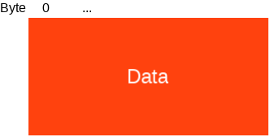
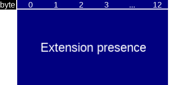
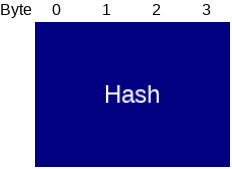
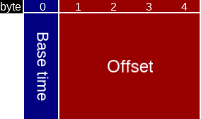

# Behaviour

This document describes the Crownstones' Behaviour concept in more technical detail.

# Table of Contents
1. [Communication API for (smartphone) applications](#api_summary)
2. [Protocol Packet Definitions](#behaviour_protocol)
3. [Firmware Design Internals](#firmware_design)

<a name="api_summary"></a>
# Communication API for (smartphone) applications

To store, update and sync Behaviours, the application can communicate over the Crownstone bluetooth protocol
by sending [Behaviour Packets](PROTOCOL.md#behaviour_packet).

The idea behind the API is that an application can only update or change the state of the stored Behaviours
if its current knowledge/model of the state is correct (which is checked by a hash). When an operation is executed,
a master Hash value that is part of the Crownstone's advertised state is updated. An application can check
its current model of the behaviour store is in sync by verifying this value.

```C++
/**
 * If expected_master_hash is not equal to the current
 * value that hash() would return, nothing happens
 * and 0xff is returned. Else,
 * returns an index in range [0,0xfe) on succes, 
 * or 0xff if it couldn't be saved.
 * 
 * A hash is computed and saved together with [b].
 */
 uint8_t save(uint32_t expected_master_hash, Behaviour b);

/**
 * Replace the behaviour at [index] with [b], if the hash of the 
 * currently saved behaviour at [index] is not equal to 
 * [expected_hash] nothing will happen and false is returned.
 * if these hashes coincide, postcondition is identical to the
 * postcondition of calling save(b) when it returns [index].
 */
bool replace(uint32_t expected_hash, uint8_t index, Behaviour b);

/**
 * deletes the behaviour at [index], if the hash of the 
 * currently saved behaviour at [index] is not equal to 
 * [expected_hash] nothing will happen and false is returned,
 * else the behaviour is removed from storage.
 */
bool remove(uint32_t expected_hash, uint8_t index);

/**
 *  returns the stored behaviour at [index].
 */
Behaviour get(uint8_t index);

/**
 * returns a map with the currently occupied indices and the 
 * behaviours at those indices.
 */
std::vector<std::pair<uint8_t,Behaviour>> get();
```

<a name="behaviour_protocol"></a>
# Protocol Packet Definitions

### Behaviour Commands

<a name="save_behaviour_packet"></a>
#### Save Behaviour Payload



When a Save Behaviour packet is received by the Crownstone, it will try to store the Behaviour represented by `Data` 
to its persistent memory. Upon success, it returns the `Index` (uint8) that can be used to refer to this behaviour. 
If the `Hash` is not equal to the current master hash of the Behaviour State, the request will not be processed.

Type | Name | Length | Description
--- | --- | --- | ---
[Behaviour Hash](#behaviour_hash) | Hash | 4 | Expected master hash before operation is executed
[Behaviour](#behaviour_payload) | Data | ... | Behaviour to save

<a name="replace_behaviour_packet"></a>
#### Replace Behaviour Payload


When a Replace Behaviour packet is received by the Crownstone, it will try to replace the behaviour at `index` by the
Behaviour represented by `Data`. If the `Hash` is not equal to the hash of the current Behaviour at given index, the 
request will not be processed.


Type | Name | Length | Description
--- | --- | --- | ---
uint8 | Index | 1 | Index of the behaviour to replace
[Behaviour Hash](#behaviour_hash) | Hash | 4 | Expected hash of the Behaviour at given index before operation is executed
[Behaviour](#behaviour_payload) | Data | ... | Behaviour to replace the current one at given index with

<a name="remove_behaviour_packet"></a>
#### Remove Behaviour Payload


When a Remove Behaviour packet is received by the Crownstone, it will try to remove the behaviour at `index`.
If the `Hash` is not equal to the hash of the current Behaviour at given index, the request will not be processed.

Type | Name | Length | Description
--- | --- | --- | ---
uint8 | Index | 1 | Index of the behaviour to remove
[Behaviour Hash](#behaviour_hash) | Hash | 4 | Expected hash of the Behaviour at given index before operation is executed

<a name="get_behaviour_packet"></a>
#### Get Behaviour Payload


When a Get Behaviour packet is received by the Crownstone it will retrieve the behaviour at given `Index`. 
If such behaviour exists, it is returned.

Type | Name | Length | Description
--- | --- | --- | ---
uint8 | Index | 1 | Index of the behaviour to obtain. 0xff for 'get all'

<a name="behaviour_payload"></a>
#### Behaviour Payload


Type | Name | Length | Description
--- | --- | --- | ---
uint8_t | Type | 1 | <ol start="0"><li>[Switch Behaviour](#switch_behaviour)</li><li>[Twilight Behaviour](#twilight_behaviour)</li><li>[Smart Timer](#smart_timer)</li></ol>
uint8_t[] | Data | ... | Type dependent

<a name="switch_behaviour"></a>
#### Switch Behaviour


Type | Name | Length | Description
--- | --- | --- | ---
uint8 | Intensity | 1 | Value from 0-100, both inclusive, indicating the desired intensity of the device (0 for 'off', 100 for 'fully on')
uint8 | Options | 1 | Bitmask, must be all 0 except for the following bits: <ol start="0"><li>Stay on until everyone has left the sphere</li><li>Stay on until everyone has left the room</li></ol>
[Day Of Week Bitmask](#day_of_week_bitmask) | Active Days | 1 | Selects which days of the week this behaviour is active
[Time Of Day](#time_of_day) | From | 5 | The behaviour is active from, inclusive, this time of day.
[Time Of Day](#time_of_day) | Until | 5 | The behaviour is active until, exclusive, this time of day.
[Presence Description](#presence_description) | Presence | 8 | Description of the presence conditions that need to hold for this behaviour to be active. 

<a name="twilight_behaviour"></a>
#### Twilight Behaviour


Type | Name | Length | Description
--- | --- | --- | ---
uint8 | Intensity | 1 | Value from 0-100, both inclusive, indicating the desired intensity of the device (0 for 'off', 100 for 'fully on')
[Day Of Week Bitmask](#day_of_week_bitmask) | Active Days | 1 | Selects which days of the week this behaviour is active
[Time Of Day](#time_of_day) | From | 5 | The behaviour is active from, inclusive, this time of day.
[Time Of Day](#time_of_day) | Until | 5 | The behaviour is active until, exclusive, this time of day.

<a name="smart_timer"></a>
#### Smart Timer

A Smart Timer consists of a Switch Behaviour and an exit condition. This can be used to ensure that for example,
when a timer expires it will wait until the room is empty before switching off the device. (Essentially extending the original behaviour.)

At the 'Until'-time of the 'Core' behaviour, it is checked wether the behaviour is still active (i.e. its presence condition is still fullfilled).
If that is the case, a temporary extension for the behaviour is created which is identical to the Core behaviour with the Presence condition replaced
by the Extension Presence and the Until time replaced by the Extension Until time. This temporary rule will be destroyed after the Extension Until time
expires. 


Type | Name | Length | Description
--- | --- | --- | ---
[Switch Behaviour](#switch_behaviour) | Core Behaviour | 20 | The core behaviour is interpreted identical to Switch Behaviour.
[End Condition](#behaviour_end_condition) | Extension End Condition |  | 

<a name="behaviour_end_condition"></a>
#### Behaviour End Condition



Type | Name | Length | Description
--- | --- | --- | ---
uint8 | Type | 1 | <ol start="0"><li>Presence extension: Pertain until presence condition fails</li><li>Time Limited Presence Extension: also destroy after time-out</li></ol>
[Presence Description](#presence_description) | Extension Presence | 8 | Description of the presence conditions that the Extension behaviour will use.
[Time Difference](#time_difference) | Extension Until | 5 | Extend the core behaviour's 'Until' time by the given difference.

<a name="behaviour_hash"></a>
#### Behaviour Hash



Type | Name | Length | Description
--- | --- | --- | ---
uint32 | Hash | 4 | [Fletcher32](https://en.wikipedia.org/wiki/Fletcher%27s_checksum) hash of a [Behaviour Payload](#behaviour_payload)

<a name="time_difference"></a>
#### Time Difference


Type | Name | Length | Description
--- | --- | --- | ---
int32 | Time Payload | 4 | Signed difference in seconds since a known-from-context moment in time (future - past >= 0).

<a name="time_of_day"></a>
#### Time Of Day



Type | Name | Length | Description
--- | --- | --- | ---
uint8 | Base Time |  1 | <ol start="0"><li>Midnight </li><li>Sundown </li><li>Sunrise</li></ol>
[Time Difference](#time_difference) | Offset | 4 | 

<a name="day_of_week_bitmask"></a>
#### Day Of Week Bitmask


Type | Name | Length | Description
--- | --- | --- | ---
uint8 | Bitmask | 1 | 0: sunday - 6: saturday. 7: must be 0.

<a name="presence_description"></a>
#### Presence Description


Type | Name | Length | Description
--- | --- | --- | ---
uint8 | Type | 1 | <ol start="0"><li>Vaccuously true condition</li><li>Anyone in any of the rooms</li><li>Noone in any of the rooms</li></ol>
uint64 | Active Rooms Mask | 8 | Room with id `i` corresponds to bit `i` in this mask.

<a name="firmware_design"></a>
# Firmware Design Internals

In the diagram below the event flow concerning Behaviours and Twilights is depicted. Double arrows (annotated) indicate which `event`'s are received and handled by the node pointed to, red/dashed objects indicate not-yet implemented features, aggregation arrows indicate object ownership as in the sense of UML and lines indicate connection to physical domain.

Main essence of the design is that there are multiple ways that a use can operate on the same switch. Each of these has their own semantics, and therefore a piece of software needs to aggregate between these input channels in order to decide what actually will have to happen. This is the job of the SwitchAggregator. The aggregator has a SystemSwitch object which takes care of the safety and integrity of the phyisical device by monitoring error states and for example blocking access in case of overheating. Any commands passed down from SystemSwitch onto HwSwitch will be pushed into the driver. This last layer allows to abstract away from any hardware specifics and later could be part of the mock-up surface.

Storing behaviours and Twilights will require additional logic in order to ensure synchronisation accross different devices/phones. All communication from and to host devices regarding Behaviours and Twilights is extracted into a Store object, that takes care of this matter. The corresponding handler object can access the store to query the active Behaviours/Twilights whenever necessary through a static reference.


