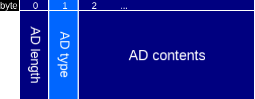

# Bluetooth Low Energy

Bluetooth Low Energy or Bluetooth LE (the Bluetooth SIG group does not want you to use BLE as an abbreviation) is
supported on most of the modern smartphones. Bluetooth LE is quite different from legacy Bluetooth. We will describe
the aspects to it that are important for hardware running the bluenet firmware.

There are seven ways the Bluetooth LE radio is used in bluenet.

1. **Receive connection commands**. To get commands from a smartphone (or hub) through a connection, see the [connection protocol](PROTOCOL.md).
2. **Receive connectionless commands**. To receive (mostly by smartphone) broadcasted Bluetooth LE advertisements, see the [broadcast protocol](BROADCAST_PROTOCOL.md).
3. **Receive connectionless presence**. To receive any type of Bluetooth LE advertisement, for in-network presence detection and in-network localization (not yet documented).
4. **Send connectionless state**. To broadcast data from bluenet about the state of the device towards smartphones etc., see the [service data protocol](SERVICE_DATA.md).
5. **Send connectionless presence**. To broadcast presence for indoor localization in the form of iBeacon messages, see [localization](LOCALIZATION.md).
6. **Send and receive over mesh**. To communicate with other bluenet devices using Bluetooth Mesh, see the [mesh overview](MESH.md) and [mesh protocol](MESH_PROTOCOL.md) documents.
7. **Send connection commands**. To set up a connection to other Crownstones or other Bluetooth LE devices (not yet documented).

### Bluetooth LE packet

The structure of a Bluetooth LE packet is as follows.

Type | Name | Length | Description
--- | --- | --- | ---
uint8 | Preamble | 1 | Preamble
uint8 | Access Address | 4 | Bluetooth LE address
uint8 | PDU | 257 | Protocol Data Unit (2-257 bytes)
uint8 | CRC | 3 | Checksum

This is on the so-called link layer. More information can be found further down in this text.

## Receive connection commands

It is possible to send some commands in a connectionless manner through encrypted advertisements which are broadcasted from a smartphone (see next section). However, it is hard to have this working properly on iOS in the background. Hence, we require connections to send on, off, dim, and other commands to the device running bluenet.

A smartphone when setting up a connection has to perform a service discovery process. Bluetooth LE services and
characteristics are obtained from the bluenet device. This process takes a while, a couple of seconds. The reason for this is that it is not truly possible to reliably cache the services and characteristics properly across all devices. If
the device running bluenet that you want to connect to is not in the proximity of the smartphone, the connection process can take quite some while or fail altogether.

For this, the so-called [ConstellationAPI](https://github.com/crownstone/crownstone-app/blob/master/docs/bleTasks/ConstellationAPI.MD) has been implemented. It sorts bluenet devices on their proximity and is able to set up a connection to a couple of them in parallel. The sessions are time-limited. You can send a series of different dim commands while using the dim slider without connecting and disconnecting within a certain time period.

There are no permanent connections. This might be something for the future to further remove delays.

* Register services and characteristics in the softdevice (the radio stack by the manufacturer).
* Receive a connection request (will only handle a single simultaneous request for now).
* Send session key.
* Send session data.
* Decrypt incoming control command.
* Encrypt responses.
* Send response over multiple notifications.
* Done

The disconnect is automatically after a timeout if not disconnected from the other side. The disconnect can also be
done directly when an explicit disconnect command is sent.

### Data channel packet

The structure of a data channel packet over which the so-called attribute protocol (ATT) is defined, is as in the following picture and table. This splits out the Protocol Data Unit (PDU) from a Bluetooth LE packet (see above).

Type | Name | Length | Description
--- | --- | --- | ---
uint8 | LL header | 2 | Link layer header
uint8 | L2CAP header | 4 | Logical link control and adaptation protocol header
uint8 | ATT header | 3 | Attribute header
uint8 | ATT payload | 244 | Attribute data (0-244 bytes)
uint8 | MIC | 4 | Message integrity check

The `LL` header can be split into multiple fields, but they are not relevant to the discussion. It contains e.g. 
information about the PDU type.

## Receive connectionless commands

The structure of a packet over an advertisement channel (37, 38, or 39) is similar, but much smaller.

Type | Name | Length | Description
--- | --- | --- | ---
uint8 | LL header | 2 | Link layer header
uint8 | MAC address | 4 | Address of the device that is advertising
uint8 | Advertisement payload | 31 | Advertisement payload (if smaller, nonsignificant part is filled/padded by zeros)

There is no message integrity check. The advertisement payload can have multiple advertisement data blocks. Each of 
these have the following structure.

Type | Name | Length | Description
--- | --- | --- | ---
uint8 | AD length | 2 | Advertisement data length
uint8 | AD type | 1 | Advertisement data type
uint8 | AD contents | N | Advertisement data contents (max 28 bytes)

## Receive connectionless presence

TBD

## Send connectionless state

TBD

## Send connectionless presence

TBD

## Send and receive over mesh

TBD

## Send connection commands

A connection exists out of the following steps (on the smartphone side):

* Set up the connection.
* Set the maximum transmission unit (MTU) of an ATT packet.
* Discover services and characteristics.
* Enable notifications.
* Read the session key.
* Read the session data.
* Encrypt and write a control command.
* Merge the incoming notifications that are returned.
* Decrypt the merged data.
* Done (disconnect).

The firmware can already receive connection commands (see first section).
