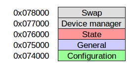

# Memory layout

This document describes the flash memory layout, and how to add more data to store. Bluenet makes use of the Persistent storage manager from the Nordic SDK.

The global layout of the the flash is shown below:


TODO: update

The bootloader start address is defined in the _CMakeBuild.config_ as `BOOTLOADER_START_ADDRESS`.

The application start address is defined in the _CMakeBuild.config_ as `APPLICATION_START_ADDRESS`.

The firmware size + free size is 352kB. For the dual bank bootloader, this means that the firmware can be 176kB max.

## App data

The app data is divided into pages of 0x1000 bytes large. The first page is used by the persistent storage manager, as swap. Bluenet has 3 pages: configuration, general, and state.
Furthermore, one page can be used for the device manager.



The order is defined _cs_Storage.h_ (`ps_storage_id`) and _cs_Storage.cpp_ (`storage_config_t`).

The app data can be read out with a script:
```
./scripts/printAppData.sh
```


### Adding a page
Since the first entry in the `ps_storage_id` and `storage_config_t` gets the lowest address on flash, and since the app data grows downwards, **a new page should be added as first entry**.
More spefically: the order is determined by the order in which `pstorage_register` is called. The first call gets the lowest address.

The number of pages should be increased in the following places:

- `PSTORAGE_NUM_OF_PAGES` in _pstorage_patform.h_
- `DFU_APP_DATA_CURRENT` in _dfu_types.h_ (in the bluenet bootloader code).

Also add a new entry in _dfu_types.h_ of the bootloader: `DFU_APP_DATA_RESERVERD_VX_X_X` and add code to handle this in _dfu_dual_bank.c_.

To make sure that no data is already at the new page, a value  should be added to an existing page. If this value is the default value (0xFFFFFFFF), then the new page should be cleared. Afterwards, the value can be set, to mark that the new page can be used.


### Swap page
The swap page is used for clear and update commands.
Since for a write, a pstorage_update is used, the following happens for each write:
- swap page is cleared
- data page is copied to swap
- data page is cleared
- swap is copied to data page, except with the new value

This makes the current cyclic storage implementation usesless for its purpose.

### Blocks
The page can be didived in several blocks. Only a whole block can be read or written at a time.

> For example, if a module has a table with 10 entries, and each entry is 64 bytes in size, it can request 10 blocks with a block size of 64 bytes. The module can also request one block that is 640 bytes depending on how it would like to access or alter the memory in persistent memory. The first option is preferred when it is a single entry that needs to be updated often and doesn't impact the other entries. The second option is preferred when table entries are not changed individually but have a common point of loading and storing data. 

Bluenet uses 1 big block per page, for flexibility of the stored data.

A better way could be to use smaller blocks and have functions to deal with values that are larger than 1 block. But whether this is actually better than the big block is unclear. Since methods `pstorage_store()`, and `pstorage_update()` can write less than a block.
Maybe a call to `pstorage_store()` uses the swap when size is less than the block size? --> Doesn't seem so from the diagram (on the _persistent storage manager_ page).

### Queuing
PStorage functions are asynchronous, but writes to flash can not happen simultaneously. This is why cs_Storage has a queue. This queue is also used to wait for high priority events to be done, like scanning and meshing.

