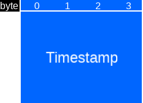
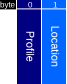
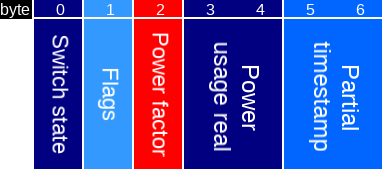
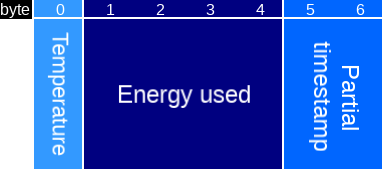
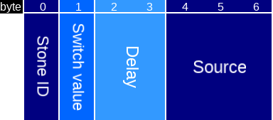

# Bluenet mesh protocol
-----------------------------------

This only documents the latest protocol, older versions can be found in the git history.

## Payload descriptor

id | name | Payload
---|---|---
0 | CS_MESH_MODEL_TYPE_TEST | [cs_mesh_model_msg_test_t](#cs_mesh_model_msg_test_t)
1 | CS_MESH_MODEL_TYPE_ACK | none
2 | CS_MESH_MODEL_TYPE_STATE_TIME | [cs_mesh_model_msg_time_t](#cs_mesh_model_msg_time_t)
3 | CS_MESH_MODEL_TYPE_CMD_TIME | [cs_mesh_model_msg_time_t](#cs_mesh_model_msg_time_t)
4 | CS_MESH_MODEL_TYPE_CMD_NOOP | none
5 | CS_MESH_MODEL_TYPE_CMD_MULTI_SWITCH | [cs_mesh_model_msg_multi_switch_item_t](#cs_mesh_model_msg_multi_switch_item_t)
8 | CS_MESH_MODEL_TYPE_STATE_0 | [cs_mesh_model_msg_state_0_t](#cs_mesh_model_msg_state_0_t)
9 | CS_MESH_MODEL_TYPE_STATE_1 | [cs_mesh_model_msg_state_1_t](#cs_mesh_model_msg_state_1_t)
10 | CS_MESH_MODEL_TYPE_PROFILE_LOCATION | [cs_mesh_model_msg_profile_location_t](#cs_mesh_model_msg_profile_location_t)
11 | CS_MESH_MODEL_TYPE_SET_BEHAVIOUR_SETTINGS | [behaviour_settings_t](#behaviour_settings_t)
12 | CS_MESH_MODEL_TYPE_TRACKED_DEVICE_REGISTER | [cs_mesh_model_msg_device_register_t](#cs_mesh_model_msg_device_register_t)
13 | CS_MESH_MODEL_TYPE_TRACKED_DEVICE_TOKEN | [cs_mesh_model_msg_device_token_t](#cs_mesh_model_msg_device_token_t)

## Packet descriptors

#### cs_mesh_model_msg_test_t

Type | Name | Length | Description
--- | --- | --- | ---
uint32 | counter | 4 | 
uint8[3] | dummy | 3 | 

#### cs_mesh_model_msg_time_t

Type | Name | Length | Description
--- | --- | --- | ---
uint32 | timestamp | 4 | posix time stamp

#### cs_mesh_model_msg_profile_location_t

Type | Name | Length | Description
--- | --- | --- | ---
uint8 | profile | 1 | 
uint8 | location | 1 |

#### cs_mesh_model_msg_state_0_t

Type | Name | Length | Description
--- | --- | --- | ---
uint8 | switchState | 1 | 
uint8 | flags | 1 |
int8 | powerFactor | 1 |
int16 | powerUsageReal | 2 |
uint16 | partialTimestamp | 2 |

#### cs_mesh_model_msg_state_1_t

Type | Name | Length | Description
--- | --- | --- | ---
int8 | temperature | 1 | 
int32 | energyUsed | 4 | 
uint16 | partialTimestamp | 2 | 

#### cs_mesh_model_msg_multi_switch_item_t

Type | Name | Length | Description
--- | --- | --- | ---
stone_id_t | id | 1 |
uint8 | switchCmd | 1 |
uint16 | delay | 2 |
cmd_source_t  | source | 3 |

#### behaviour_settings_t

Type | Name | Length | Description
--- | --- | --- | ---
uint32 | flags | 4 | only bit 0 is currently in use, as 'behaviour enabled'. Other bits must remain 0. 

#### cs_mesh_model_msg_device_register_t

Type | Name | Length | Description
--- | --- | --- | ---
device_id_t | deviceId | 2 |
uint8 | locationId | 1 |
uint8 | profileId | 1 |
int8 | rssiOffset | 1 |
uint8 | flags | 1 |
uint8 | accessLevel | 1 |

#### cs_mesh_model_msg_device_token_t

Type | Name | Length | Description
--- | --- | --- | ---
device_id_t | deviceId | 2 |
uint8[3] | deviceToken | 3 |
uint16 | ttlMinutes | 2 |
