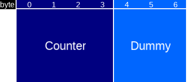
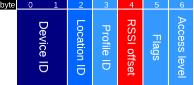
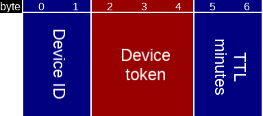
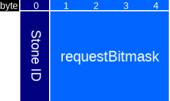
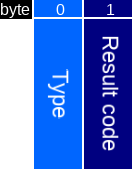

# Bluenet mesh protocol
-----------------------------------

This only documents the latest protocol, older versions can be found in the git history.

## Message types

id | name | Payload | Result data
---|---|---|---
0 | CS_MESH_MODEL_TYPE_TEST | [cs_mesh_model_msg_test_t](#cs_mesh_model_msg_test_t)
1 | CS_MESH_MODEL_TYPE_ACK | none
2 | CS_MESH_MODEL_TYPE_STATE_TIME | [cs_mesh_model_msg_time_t](#cs_mesh_model_msg_time_t)
3 | CS_MESH_MODEL_TYPE_CMD_TIME | [cs_mesh_model_msg_time_t](#cs_mesh_model_msg_time_t)
4 | CS_MESH_MODEL_TYPE_CMD_NOOP | none
5 | CS_MESH_MODEL_TYPE_CMD_MULTI_SWITCH | [cs_mesh_model_msg_multi_switch_item_t](#cs_mesh_model_msg_multi_switch_item_t)
8 | CS_MESH_MODEL_TYPE_STATE_0 | [cs_mesh_model_msg_state_0_t](#cs_mesh_model_msg_state_0_t)
9 | CS_MESH_MODEL_TYPE_STATE_1 | [cs_mesh_model_msg_state_1_t](#cs_mesh_model_msg_state_1_t)
10 | CS_MESH_MODEL_TYPE_PROFILE_LOCATION | [cs_mesh_model_msg_profile_location_t](#cs_mesh_model_msg_profile_location_t)
11 | CS_MESH_MODEL_TYPE_SET_BEHAVIOUR_SETTINGS | [behaviour_settings_t](#behaviour_settings_t)
12 | CS_MESH_MODEL_TYPE_TRACKED_DEVICE_REGISTER | [cs_mesh_model_msg_device_register_t](#cs_mesh_model_msg_device_register_t)
13 | CS_MESH_MODEL_TYPE_TRACKED_DEVICE_TOKEN | [cs_mesh_model_msg_device_token_t](#cs_mesh_model_msg_device_token_t)
14 | CS_MESH_MODEL_TYPE_SYNC_REQUEST | [cs_mesh_model_msg_sync_request_t](#cs_mesh_model_msg_sync_request_t)
16 | CS_MESH_MODEL_TYPE_TRACKED_DEVICE_LIST_SIZE | [cs_mesh_model_msg_device_list_size_t](#cs_mesh_model_msg_device_list_size_t)
17 | CS_MESH_MODEL_TYPE_STATE_SET | [cs_mesh_model_msg_state_set](#cs_mesh_model_msg_state_set) | [cs_mesh_model_msg_state_header_t](#cs_mesh_model_msg_state_header_t)
18 | CS_MESH_MODEL_TYPE_RESULT | [cs_mesh_model_msg_result](#cs_mesh_model_msg_result)

## Packet descriptors

#### cs_mesh_model_msg_test_t

Type | Name | Length | Description
--- | --- | --- | ---
uint32 | Counter | 4 |
uint8[3] | Dummy | 3 |

#### cs_mesh_model_msg_time_t

Type | Name | Length | Description
--- | --- | --- | ---
uint32 | Timestamp | 4 | posix time stamp

#### cs_mesh_model_msg_profile_location_t

Type | Name | Length | Description
--- | --- | --- | ---
uint8 | Profile | 1 |
uint8 | Location | 1 |

#### cs_mesh_model_msg_state_0_t

Type | Name | Length | Description
--- | --- | --- | ---
uint8 | Switch state | 1 |
uint8 | Flags | 1 |
int8 | Power factor | 1 |
int16 | Power usage real | 2 |
uint16 | Partial timestamp | 2 |

#### cs_mesh_model_msg_state_1_t

Type | Name | Length | Description
--- | --- | --- | ---
int8 | Temperature | 1 |
int32 | Energy used | 4 |
uint16 | Partial timestamp | 2 |

#### cs_mesh_model_msg_multi_switch_item_t

Type | Name | Length | Description
--- | --- | --- | ---
stone_id_t | Stone ID | 1 |
uint8 | Switch value | 1 |
uint16 | Delay | 2 |
cmd_source_t  | Source | 3 |

#### behaviour_settings_t

Type | Name | Length | Description
--- | --- | --- | ---
uint32 | Flags | 4 | only bit 0 is currently in use, as 'behaviour enabled'. Other bits must remain 0.

#### cs_mesh_model_msg_device_register_t

Type | Name | Length | Description
--- | --- | --- | ---
device_id_t | Device ID | 2 |
uint8 | Location ID | 1 |
uint8 | Profile ID | 1 |
int8 | RSSI offset | 1 |
uint8 | Flags | 1 |
uint8 | Access level | 1 |

#### cs_mesh_model_msg_device_token_t

Type | Name | Length | Description
--- | --- | --- | ---
device_id_t | Device ID | 2 |
uint8[3] | Device token | 3 |
uint16 | TTL minutes | 2 |

#### cs_mesh_model_msg_device_list_size_t

Type | Name | Length | Description
--- | --- | --- | ---
uint8_t | List size | 1 | Size of tracked devices list.

#### cs_mesh_model_msg_sync_request_t

Type | Name | Length | Description
--- | --- | --- | ---
uint8_t | Stone ID | 1 | ID of stone that requests for a sync.
uint32_t | [requestBitmask](#cs_mesh_model_sync_bitmask) | 4 | Bitmask of all things that are requested to be synced.

#### Sync bitmask

Bit | Name |  Description
--- | --- | ---
0 | Time |
1 | Registered devices |
2-31 | Reserved | Reserved for future use, must be 0 for now.

#### cs_mesh_model_msg_state_set

Type | Name | Length | Description
--- | --- | --- | ---
[state header](#cs_mesh_model_msg_state_header_ext_t) | State header | 3 |
uint8_t[] | Payload | N | Payload data, depends on state type.

#### cs_mesh_model_msg_state_header_ext_t

Type | Name | Length in bits | Description
--- | --- | --- | ---
[cs_mesh_model_msg_state_header_t](#cs_mesh_model_msg_state_header_t) | Header | 16 | State header.
uint8_t | Access level | 3 | Shortened version of access level: 0=ADMIN, 1=MEMBER, 2=BASIC, 6=SETUP, 7=NOT_SET.
uint8_t | Source ID | 5 | Shortened version of source ID: 0=NONE, 1=DEFAULT, 2=INTERNAL, 3=UART, 4=CONNECTION, 5=SWITCHCRAFT, 30=DEVICE_TOKEN, 31=NOT_SET

#### cs_mesh_model_msg_state_header_t

Type | Name | Length in bits | Description
--- | --- | --- | ---
uint8_t | Type | 8 | [State type](PROTOCOL.md#state_types).
uint8_t | State ID | 6 | ID of state to get. Most state types will only have ID 0.
uint8_t | [Persistence mode](PROTOCOL.md#state_set_persistence_mode_set) | 2 | Type of persistence mode.

#### cs_mesh_model_msg_result

Type | Name | Length | Description
--- | --- | --- | ---
[result header](#cs_mesh_model_msg_result_header_t) | Result header | 2 | Header.
uint8_t[] | Payload | N | Payload data, depends on result type.

#### cs_mesh_model_msg_result_header_t

Type | Name | Length | Description
--- | --- | --- | ---
uint8_t | [Type](#message_types) | 1 | The type of mesh msg this is the result of.
uint8_t | [Result code](PROTOCOL.md#result_codes) | 1 | Shortened version of result code.

